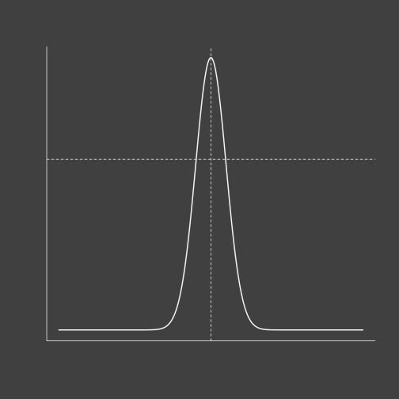

# Contenu du cours

<!-- *** les notes du cours -->

1. <a href="#" target="_self" data-slide=3> Introduction </a>

2.  <a href="#" target="_self" rel='tooltip'
        data-slide=5 title='Exemple à deux colonnes'>
         5
      </a>

3. [Laboratoire d'Ecologie Integrative](http://ielab.recherche.usherbrooke.ca)

--- .transition

# Introduction
## Sous-titre


---
#  Exemple diapositive claire

- Bonnes pratiques
- Présentation du projet


--- .dark
# Exemple diapositive sombre

- Bonnes pratiques
- Présentation du projet


--- &twocol
# Exemple à deux colonnes

Avant les deux colonnes

*** =left
- Bonnes pratiques

*** =right
- Présentation du projet


--- &twocol .dark
# Exemple à deux colonnes

Avant les deux colonnes

*** =left
- Bonnes pratiques

*** =right
- Présentation du projet


--- &twocolw w1:40% w2:60%
# Exemple à deux colonnes à largeurs modifiables  

Avant les deux colonnes

*** =left
- Bonnes pratiques

*** =right
- Présentation du super maxi projet


--- &twocol
# Exemple avec apparitions succéssives

> - point 1
> - point 2
> - point 3
> - point 4


---
# Un exemple de citation

<br/>
<br/>

> Lorem ipsum dolor sit amet, consectetur adipisicing elit, sed do eiusmod tempor incididunt ut labore et dolore magna aliqua. Ut enim ad minim veniam, quis nostrud exercitation ullamco laboris nisi ut aliquip ex ea commodo consequat. Duis aute irure dolor in reprehenderit in voluptate velit esse cillum dolore eu fugiat nulla pariatur. Excepteur sint occaecat cupidatat non proident.


---
# Une insertion de code autre que du R

- du C :

```c
int i, k;
k = 0;
for (i=0; i<10; i++){
  k++;
}
```

- du python :

```python
x = 1
if x == 1:
    # indented four spaces
    print "x is 1."
```

---
# Insertion de code R sans execution

```r
mod <- lm(runif(100)~1)
summary(mod)
```

---
# Insertion de code R et execution


```r
mod <- lm(runif(100)~1)
summary(mod)
```

```
R> 
R> Call:
R> lm(formula = runif(100) ~ 1)
R> 
R> Residuals:
R>      Min       1Q   Median       3Q      Max 
R> -0.54293 -0.18809 -0.01518  0.24400  0.44983 
R> 
R> Coefficients:
R>             Estimate Std. Error t value Pr(>|t|)    
R> (Intercept)  0.54596    0.02834   19.27   <2e-16 ***
R> ---
R> Signif. codes:  0 '***' 0.001 '**' 0.01 '*' 0.05 '.' 0.1 ' ' 1
R> 
R> Residual standard error: 0.2834 on 99 degrees of freedom
```

---
# Execution affichage du résultat seulement


```
## 
## Call:
## lm(formula = runif(100) ~ 1)
## 
## Residuals:
##      Min       1Q   Median       3Q      Max 
## -0.45615 -0.27485 -0.02098  0.27726  0.49784 
## 
## Coefficients:
##             Estimate Std. Error t value Pr(>|t|)    
## (Intercept)  0.50066    0.02965   16.89   <2e-16 ***
## ---
## Signif. codes:  0 '***' 0.001 '**' 0.01 '*' 0.05 '.' 0.1 ' ' 1
## 
## Residual standard error: 0.2965 on 99 degrees of freedom
```


---
# Utiliser Mathjax

- Math en ligne de commande $\sum i^2$

- une équation :

$$
\begin{align*}
2x^2 + 3(x-1)(x-2) & = 2x^2 + 3(x^2-3x+2)\\&= 2x^2 + 3x^2 - 9x + 6\\&= 5x^2 - 9x + 6
\end{align*}
$$

---
# Utiliser fontawesome

- Sans lien\&nbsp;:

<i class="fa fa-globe" aria-hidden="true"></i>
<i class="fa fa-file-pdf-o" aria-hidden="true"></i>

- Avec un lien :

[<i class="fa fa-gitlab" fa-4x></i>](https://about.gitlab.com)
[<i class="fa fa-github" fa-4x></i>](https://github.com)


--- .dark
# Utiliser fontawesome (dark version)

- Sans lien\&nbsp;:

<i class="fa fa-globe" aria-hidden="true"></i>
<i class="fa fa-file-pdf-o" aria-hidden="true"></i>

- Avec un lien :

[<i class="fa fa-gitlab" fa-4x></i>](https://about.gitlab.com)
[<i class="fa fa-github" fa-4x></i>](https://github.com)

--- .transition
# Collecte et organisation des données
## Coucou

---
# Premier titre

--- .transition

# Outils pour une science reproductible


---
# UNIX

```bash
pwd
echo "cool"
for i in `seq 1 10`; do echo $i; done
```


---
# Git, Github et Gitlab

- Utiliser [*font-awesome*](http://fontawesome.io)

[<i class="fa fa-git" fa-4x></i>](https://git-scm.com)

[<i class="fa fa-gitlab" fa-4x></i>](https://about.gitlab.com)

[<i class="fa fa-github" fa-4x></i>](https://github.com)

--- .transition

# Visualisation
## représenter ses données (2 cours)


<!-- Loading the script associated to this section -->


--- &twocol

# Graphiques avec R


*** =left


```r
plot(0,0)
```

*** pnotes Ici on peu entrer les notes dont on a besoin.

*** =right


--- &twocol

# Graphiques avec R


*** =left


```r
par(bg = "grey25", fg="grey95")
x <- seq(-10,10,0.01)
plot(x,dnorm(x), type="n", ann=F, axes=F)
lines(x,dnorm(x), lwd=2)
box(bty="l")
abline(h=.25, v=0, lty=2)
```

*** =right




---

# Graphiques avec R


```r
par(bg = "transparent")
plot(0,0)
```


--- .transition
# Communication
## faciliter la transmission du savoir


---
# Latex

- Exemple de code latex

```Tex
\documentclass{article}
\usepackage[koi8-r]{inputenc}

\tolerance=400
\newcommand{\eTiX}{\TeX}
\begin{document}
\section*{Highlight.js}
\begin{table}[c|c]
$\frac 12\, + \, \frac 1{x^3}\text{Hello \! world}$ & \textbf{Goodbye\~ world} \\\eTiX $ \pi=400 $
\end{table}
$$
    \int\limits_{0}^{\pi}\frac{4}{x-7}=3
$$
\end{document}
```

---
# Beamer

--- .transition
# Resources
## pour en savoir plus
